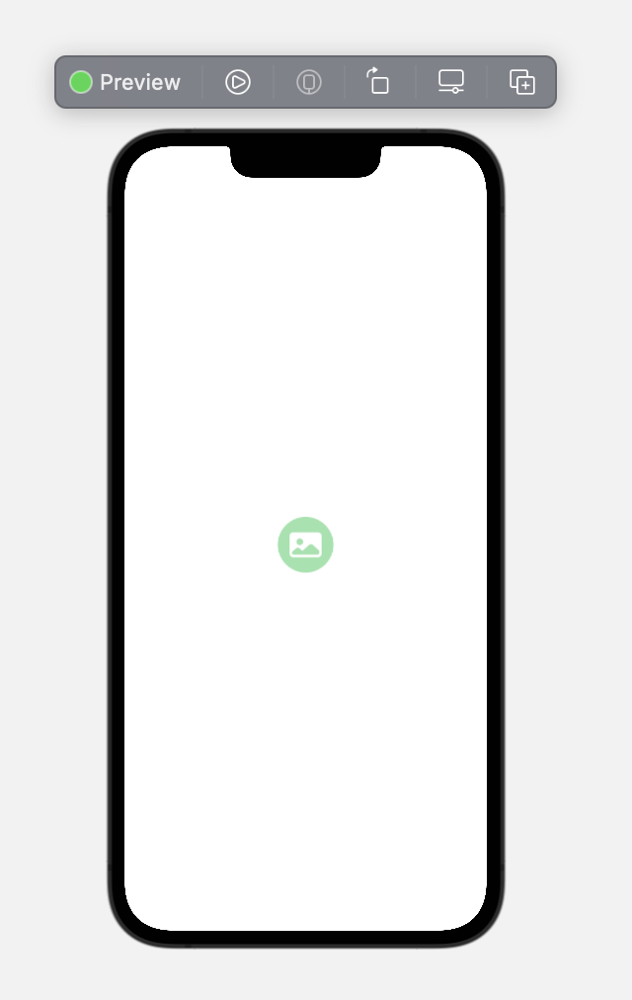
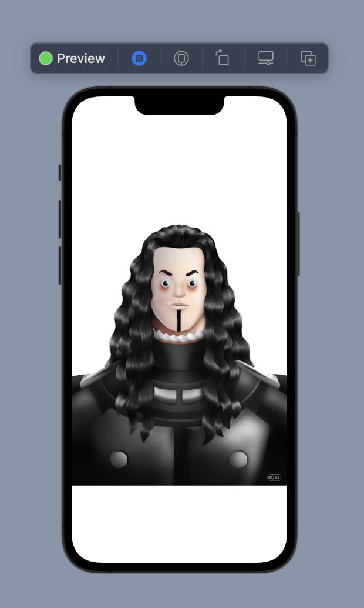

# AsyncImage-Yukleme-HataIkon

Asenkron internettten görsel yüklemede yükleme öncesi ve hata ikonlarının gösterilmesi için yazılmıştır.

async.swift 'te if else yapısı ile yazılmıştır.

switch.swift 'te switch case yapısı ile kullanılmıştır.

